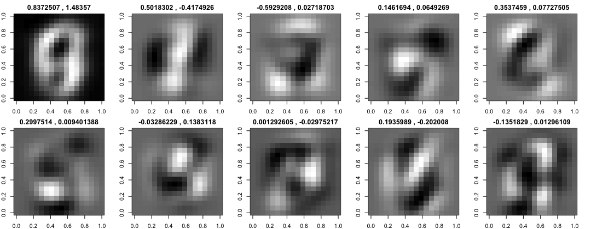

## 2.4.5

|Cipher|PC1|         PC2|         PC3|         PC4|         PC5|         PC6|         PC7|         PC8 |PC9    |    PC10 |
|---|---|---|---|---|---|---|---|---|---|---|
|0 (43)|0.89881150 | 0.13218921| -0.26592992 | 0.02620752 | 0.32310330 | 0.35373291 | 0.06616662 |-0.31915394  |0.35917030| -0.36144824 |
|0 (456)| 1.507370730 |-0.445392431 | 0.055150857  |0.004585787 | 0.064170593|  0.125690786 | 0.028805782 | 0.065597007 |-0.184172389| -0.039411853 |
|means 0|0.837250746 | 0.501830179 |-0.592920850 | 0.146169384 | 0.353745919 | 0.299751384 |-0.032862295| 0.001292605 | 0.193598886| -0.135182851|
|means 1|1.483570160| -0.417492570 | 0.027187034 | 0.064926902 | 0.077275045 | 0.009401388 | 0.138311762 |-0.029752175| -0.202008017 | 0.012961091|
|difference means 0 and 1|0.6463194| 0.9193227| 0.6201079| 0.08124248| 0.2764709| 0.29035| 0.1711741| 0.03104478| 0.3956069| 0.1481439|

This image shows the mean scores for the first 10 eigenvectors (EVs). The first number at each EV is the mean score for all zeros and the second number is the mean score for all ones. A high positive number will use a lot from this EV for it's output and a high negativ number will substract this part from the output image. For example the first EV is describing the white space around the digits and has a high value on both of them. The second EV describes the left and right borders of the zero, and therefore have a high value on the zero means, but a low value on the one digits mean. In generall we can say as higher the score value as more impact the corresponding EV has to the output. For the zero cipher, the EVs 1,2,3,4,5,6,9 and 10 have an high impact. And for the one cipher the EVs 1,2,6 and 9 have an high impact.
