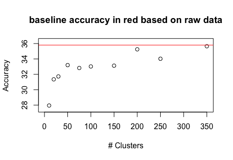
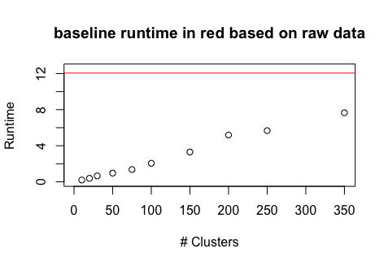
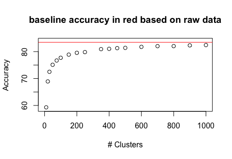
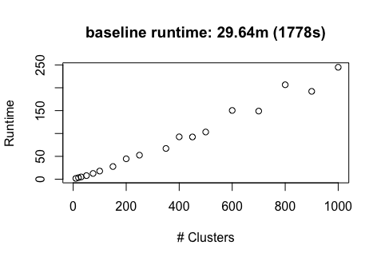
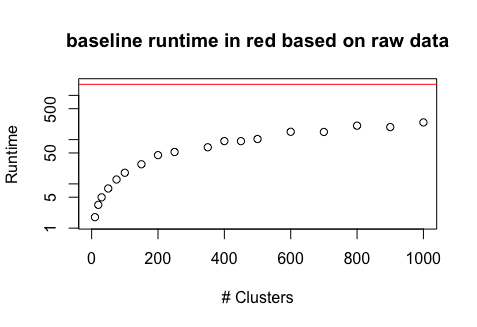

## 3.1.1 and 3.1.2
The **accuracy improves** with the amount of pre-clustered k-means centroids in a **logarithmic manner**. Baseline performance of k-NN without pre clustered training data in red. Because of random starting points a **cross-validation** was performed. Therefore we ran the check 10 times and **plot the mean accuracy**.

The is runtime increasing with the amount of pre-clustered k-means centroids linearly. Baseline runtime of k-NN without pre clustered training data in red. For cross-validation we took the mean runtime of 10 runs.

A good amount of pre-clustered centroids where we can achieve a good performance while still having a good runtime seems to be arround **200 centroids**.

## 3.1.2
Now we perform the same on a bigger dataset with a **train/test** split of **30/17**. As we can see in the accuracy chart, the accuracy quickly reaches nearly the same accuracy as without k-means clustering.
### accuracy quickly reaches nearly the baseline accuracy

The runtime still increases linearly with the amount of k-means clusters.
### linear increasing runtime

But compared to the baseline runtime without pre-clustered train data, the k-means optimized version is way faster while still having the same accuracy and therefore has a way better performance. 
### huge difference in runtime compared to baseline (notice logarithmic plot)

