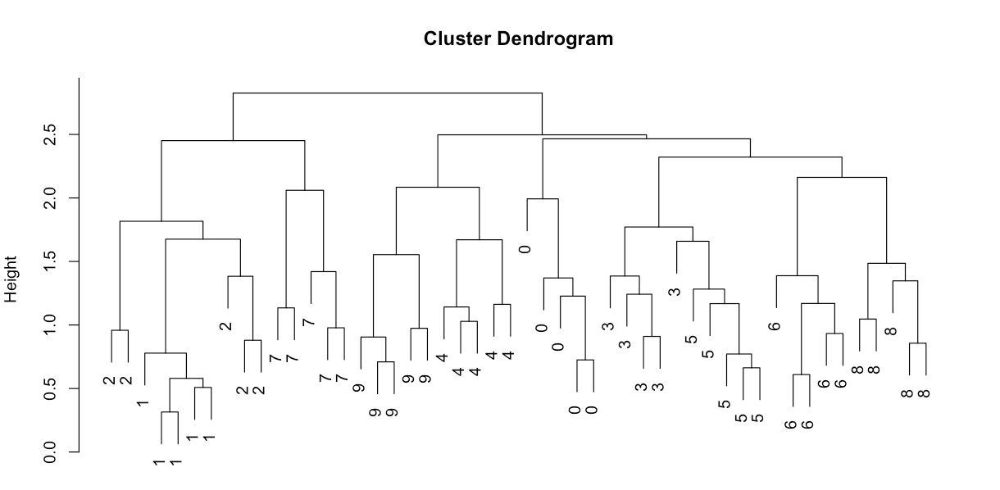
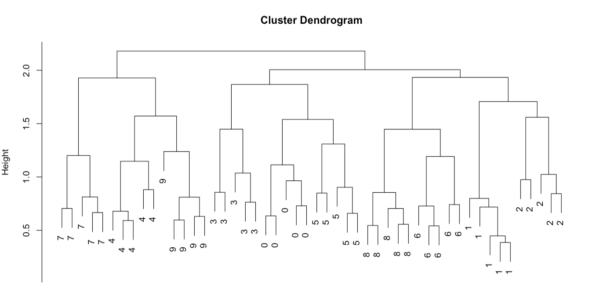

# 3.2 : Hierarchical clustering

## 3.2.1

<i>Dendrogram containing the five first instances of each digits for a single person</i>

## 3.2.2

<i>Dendrogram containing the five clusters of each digits for a single person</i>

## 3.2.3

In the first dendrogram we can see that the clusters are not very accurate.
