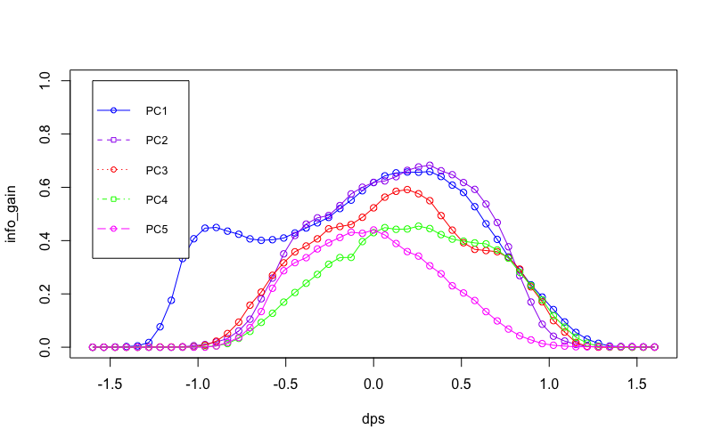
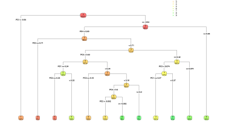

# 4.1 : Decision Trees

## 4.1.1

<i>PC2 brings the highest information gain with a threshold of arround 0.4. This would be the best split for our decission tree</i>

## 4.1.2

<i>A decission tree for dataset of one person based on the same 5 PCA Components as above</i>
