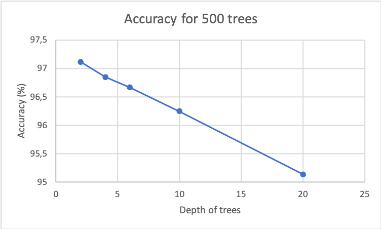
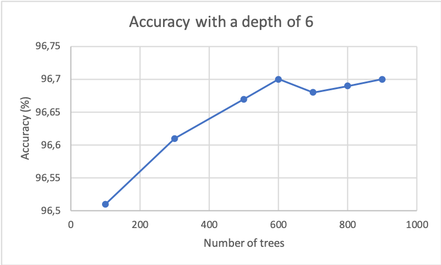

# 4.2 : Random Forest

We used the data as 'All persons in' for the training and testing sets.

We performed a PCA on the data and kept 25 PC which gave us 90% of the variance. It allowed us to reduce the runtimes and
to get relatively reliable data to use.

As a starting point, we used the default values for the number of trees and the depth of each tree : 500 and 6 respectively.
To validate our random forest classifier, we used a cross-validation on 5 different testsets of 20% each, once again to get 
a runtime we could work with.

The accuracies from this cross validation are : 96.61, 96.21, 96.58, 96.75 and 96.73. Our classifier is reliable.

We then proceeded to evaluate the impact of the number of trees and the depth of each tree on the accuracy of the random forest.

We started with the set default number of trees (500) and changed the depth :

And then with the set default depth of 6 and changed the number of trees :

We can see that the accuracy goes up when we reduce the depth of the trees for a set number of trees and with a greater number of trees for a set depth.

We cannot increase indefinitely the number of trees because the runtime increases with the number of trees in the forest.
